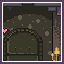
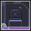

# Design Doc for [Where is my Heart?](https://retroachievements.org/game/18190)
## Table of Contents
1. [About](#about)
2. [Learnings](#learnings)
3. [Code Notes](#code-notes)
4. [Achievements](#achievements)
5. [Leaderboards](#leaderboards)
## About
<sub>[Back to Table of Contents](#table-of-contents)</sub>
- [Game Page](https://retroachievements.org/game/18190)
- [Forum Topic](https://retroachievements.org/forums/topic/29038)
## Learnings
<sub>[Back to Table of Contents](#table-of-contents)</sub>
## Code Notes
<sub>[Back to Table of Contents](#table-of-contents)</sub>
### Code Notes Navigation
1. [Code Note 0x000000](#code-note-0x000000)
2. [Code Note 0x9e6538](#code-note-0x9e6538)
3. [Code Note 0x9e7130](#code-note-0x9e7130)
4. [Code Note 0xa43a40](#code-note-0xa43a40)
5. [Code Note 0xa43a41](#code-note-0xa43a41)
6. [Code Note 0xb16038](#code-note-0xb16038)
7. [Code Note 0xb16044](#code-note-0xb16044)
8. [Code Note 0xb16048](#code-note-0xb16048)
9. [Code Note 0xb160d4](#code-note-0xb160d4)
10. [Code Note 0xb160e4](#code-note-0xb160e4)
11. [Code Note 0xb17f18](#code-note-0xb17f18)
12. [Code Note 0xb17f71](#code-note-0xb17f71)
13. [Code Note 0xb17f80](#code-note-0xb17f80)
14. [Code Note 0xb1f0f8](#code-note-0xb1f0f8)
15. [Code Note 0xb23d78](#code-note-0xb23d78)
16. [Code Note 0xe679c8](#code-note-0xe679c8)
17. [Code Note 0xe67ec8](#code-note-0xe67ec8)
18. [Code Note 0xe7b9c8](#code-note-0xe7b9c8)
19. [Code Note 0xe80b8a](#code-note-0xe80b8a)
### Code Note 0x000000
<sub>[Back to navigation](#code-notes-navigation)</sub><br>
<br>Author: [joshraphael](https://retroachievements.org/user/joshraphael)<br>
```txt
RAScript: https://github.com/joshraphael/ra18190/blob/main/18190.rascript
```
### Code Note 0x9e6538
<sub>[Back to navigation](#code-notes-navigation)</sub><br>
<br>Author: [joshraphael](https://retroachievements.org/user/joshraphael)<br>
```txt
[32-bit] Orange Rotating World

0x00000000 = Not Rotating
0x00000001 = Rotating
```
### Code Note 0x9e7130
<sub>[Back to navigation](#code-notes-navigation)</sub><br>
<br>Author: [joshraphael](https://retroachievements.org/user/joshraphael)<br>
```txt
[32-bit] Animation Counter

this seems to be a counter that changes when any of the players does anything (idle animation, step, jump, etc). use it in combination with button presses to detect Orange's world rotation count.
```
### Code Note 0xa43a40
<sub>[Back to navigation](#code-notes-navigation)</sub><br>
<br>Author: [joshraphael](https://retroachievements.org/user/joshraphael)<br>
```txt
[8-bit] Button Press Flags Group 1

0 = not currently pressed
1 = currently pressed

Bit 0 = Select
Bit 1 = N/A
Bit 2 = N/A
Bit 3 = Start
Bit 4 = D-Pad Up
Bit 5 = D-Pad Right
Bit 6 = D-Pad Down
Bit 7 = D-Pad Left
```
### Code Note 0xa43a41
<sub>[Back to navigation](#code-notes-navigation)</sub><br>
<br>Author: [joshraphael](https://retroachievements.org/user/joshraphael)<br>
```txt
[8-bit] Button Press Flags Group 2

0 = not currently pressed
1 = currently pressed

Bit 0 = Left Bumper
Bit 1 = Right Bumper
Bit 2 = N/A
Bit 3 = N/A
Bit 4 = Triangle Button
Bit 5 = Oh Button
Bit 6 = Ex Button
Bit 7 = Square Button
```
### Code Note 0xb16038
<sub>[Back to navigation](#code-notes-navigation)</sub><br>
<br>Author: [joshraphael](https://retroachievements.org/user/joshraphael)<br>
```txt
[32-bit] Game Pointer

Anything other than 0x00000000 is an address to the currently playing chapters data

(use & value 0x01ffffff)

0x00000000 = In Main Menu
+0x088 = Pointer [32-bit]
.+0x000 = Pointer [32-bit]
..+0x014 = Pointer [32-bit]
...+0x008 = Current Chapter Score [32-bit]
...+0x00c = Hearts Collected [32-bit]
...+0x010 = Dark Hearts Collected [32-bit]
...+0x014 = Hearts Available [32-bit]
+0x244 = Current Character [32-bit]
0x00000000 = Brown
0x00000001 = Orange
0x00000002 = Gray
+0x284 = Current Chapter Timer [32-bit]
```
### Code Note 0xb16044
<sub>[Back to navigation](#code-notes-navigation)</sub><br>
<br>Author: [joshraphael](https://retroachievements.org/user/joshraphael)<br>
```txt
[32-bit] Game State

0x00000000 = Playing Chapter
0x00000001 = In Start Menu
```
### Code Note 0xb16048
<sub>[Back to navigation](#code-notes-navigation)</sub><br>
<br>Author: [joshraphael](https://retroachievements.org/user/joshraphael)<br>
```txt
[32-bit] Score

Max 172
```
### Code Note 0xb160d4
<sub>[Back to navigation](#code-notes-navigation)</sub><br>
<br>Author: [joshraphael](https://retroachievements.org/user/joshraphael)<br>
```txt
[32-bit] Chapter

0x0000001b = Chapter 1
0x00000000 = Chapter 2
0x00000003 = Chapter 3
0x00000004 = Chapter 4
0x00000005 = Chapter 5
0x00000008 = Chapter 6
0x0000000a = Chapter 7
0x00000016 = Chapter 8
0x00000006 = Chapter 9
0x00000013 = Chapter 10
0x0000000b = Chapter 11
0x00000007 = Chapter 12
0x0000000c = Chapter 13
0x0000000d = Chapter 14
0x0000000e = Chapter 15
0x0000000f = Chapter 16
0x00000010 = Chapter 17
0x00000012 = Chapter 18
0x00000001 = Chapter 19
0x00000002 = Chapter 20
0x00000014 = Chapter 21
0x00000015 = Chapter 22
0x0000001d = Chapter 23
0x00000017 = Chapter 24
0x00000018 = Chapter 25
0x00000019 = Chapter 26
0x0000001a = Credits
0x00000063 = Main Menu (Post Game)
```
### Code Note 0xb160e4
<sub>[Back to navigation](#code-notes-navigation)</sub><br>
<br>Author: [joshraphael](https://retroachievements.org/user/joshraphael)<br>
```txt
[32-bit] Chapter Timer
```
### Code Note 0xb17f18
<sub>[Back to navigation](#code-notes-navigation)</sub><br>
<br>Author: [joshraphael](https://retroachievements.org/user/joshraphael)<br>
```txt
[32-bit] Brown Power Up Status

0x00000000 = Idle
0x00000001 = Moving Left Or Right
0x00000002 = Jumping Up
0x00000003 = Falling Down
0x00000004 = Landing
0x00000005 = Taking Damage
0x00000006 = Entering Tree
0x00000007 = Inside Tree
0x00000008 = Normal Mode (refer to 0xe679c8)
```
### Code Note 0xb17f71
<sub>[Back to navigation](#code-notes-navigation)</sub><br>
<br>Author: [joshraphael](https://retroachievements.org/user/joshraphael)<br>
```txt
[8-bit] Brown Double Jumping

0x00 = Not Double Jumping
0x01 = Double Jumping
```
### Code Note 0xb17f80
<sub>[Back to navigation](#code-notes-navigation)</sub><br>
<br>Author: [joshraphael](https://retroachievements.org/user/joshraphael)<br>
```txt
[16-bit] Double Jump Count
```
### Code Note 0xb1f0f8
<sub>[Back to navigation](#code-notes-navigation)</sub><br>
<br>Author: [joshraphael](https://retroachievements.org/user/joshraphael)<br>
```txt
[32-bit] Gray Status

0x00000000 = Idle
0x00000001 = Moving Left Or Right
0x00000002 = Jumping Up
0x00000003 = Falling Down
0x00000004 = Landing
0x00000005 = Taking Damage
0x00000006 = Entering Tree
0x00000007 = Inside Tree
0x00000008 = Powered Up Mode (refer to 0xb23d78)
```
### Code Note 0xb23d78
<sub>[Back to navigation](#code-notes-navigation)</sub><br>
<br>Author: [joshraphael](https://retroachievements.org/user/joshraphael)<br>
```txt
[32-bit] Gray Powered Up Status

0x00000000 = Idle
0x00000001 = Moving Left Or Right
0x00000002 = Jumping Up
0x00000003 = Falling Down
0x00000004 = Landing
0x00000005 = Taking Damage
0x00000006 = Entering Tree
0x00000007 = Inside Tree
0x00000008 = Normal Mode (refer to 0xb1f0f8)
```
### Code Note 0xe679c8
<sub>[Back to navigation](#code-notes-navigation)</sub><br>
<br>Author: [joshraphael](https://retroachievements.org/user/joshraphael)<br>
```txt
[32-bit] Brown Status

0x00000000 = Idle
0x00000001 = Moving Left Or Right
0x00000002 = Jumping Up
0x00000003 = Falling Down
0x00000004 = Landing
0x00000005 = Taking Damage
0x00000006 = Entering Tree
0x00000007 = Inside Tree
0x00000008 = Powered Up Mode (refer to 0xb17f18)
```
### Code Note 0xe67ec8
<sub>[Back to navigation](#code-notes-navigation)</sub><br>
<br>Author: [joshraphael](https://retroachievements.org/user/joshraphael)<br>
```txt
[32-bit] Orange Status

0x00000000 = Idle
0x00000001 = Moving Left Or Right
0x00000002 = Jumping Up
0x00000003 = Falling Down
0x00000004 = Landing
0x00000005 = Taking Damage
0x00000006 = Entering Tree
0x00000007 = Inside Tree
0x00000008 = Powered Up Mode (refer to 0xe7b9c8)
```
### Code Note 0xe7b9c8
<sub>[Back to navigation](#code-notes-navigation)</sub><br>
<br>Author: [joshraphael](https://retroachievements.org/user/joshraphael)<br>
```txt
[32-bit] Orange Powered Up Status

0x00000000 = Idle
0x00000001 = Moving Left Or Right
0x00000002 = Jumping Up
0x00000003 = Falling Down
0x00000004 = Landing
0x00000005 = Taking Damage
0x00000006 = Entering Tree
0x00000007 = Inside Tree
0x00000008 = Normal Mode (refer to 0xe67ec8)
```
### Code Note 0xe80b8a
<sub>[Back to navigation](#code-notes-navigation)</sub><br>
<br>Author: [joshraphael](https://retroachievements.org/user/joshraphael)<br>
```txt
[16-bit] Start Menu Option

0x0000 = NEW
0x0001 = LOAD
0x0002 = DELETE
0x0003 = HOW TO
0x0004 = CREDITS
0x0005 = SAVE
```
## Achievements
<sub>[Back to Table of Contents](#table-of-contents)</sub>
### Achievements Navigation
1. [The Heart Tree (Achievement 509517)](#achievement-509517)
2. [Totem Spirit (Achievement 509518)](#achievement-509518)
3. [We Are on Our Way (Achievement 509519)](#achievement-509519)
4. [Gotta Go Fast (Achievement 509520)](#achievement-509520)
5. [Wilderness (Achievement 509521)](#achievement-509521)
6. [Mind the Gap (Achievement 509522)](#achievement-509522)
7. [A Little Cave (Achievement 509523)](#achievement-509523)
8. [Rock Tunnel (Achievement 509524)](#achievement-509524)
9. [Antler Ancestor (Achievement 509525)](#achievement-509525)
10. [Gallup Jingle (Achievement 509526)](#achievement-509526)
11. [Rainbow Spirit (Achievement 509513)](#achievement-509513)
12. [A Slight Breeze (Achievement 509514)](#achievement-509514)
13. [Wall in the Meadow (Achievement 509527)](#achievement-509527)
14. [Great Wall (Achievement 509528)](#achievement-509528)
15. [Bridge (Achievement 509515)](#achievement-509515)
16. [Water Under the Bridge (Achievement 509516)](#achievement-509516)
17. [Islands (Achievement 509529)](#achievement-509529)
18. [Island Hopping (Achievement 509530)](#achievement-509530)
19. [Serpentine (Achievement 509531)](#achievement-509531)
20. [Zig Zag (Achievement 509532)](#achievement-509532)
21. [Flying Rocks (Achievement 509533)](#achievement-509533)
22. [Rock of Terror (Achievement 509534)](#achievement-509534)
23. [Little Fern Track (Achievement 509535)](#achievement-509535)
24. [Glowing Fern (Achievement 509536)](#achievement-509536)
25. [Sky and Cave (Achievement 509537)](#achievement-509537)
26. [Descent Into Bat Kings Cave (Achievement 509538)](#achievement-509538)
27. [Fall (Achievement 509539)](#achievement-509539)
28. [Falling in Love (Achievement 509540)](#achievement-509540)
29. [Bat King (Achievement 509541)](#achievement-509541)
30. [Beady Eyed (Achievement 509542)](#achievement-509542)
31. [Secret Passage (Achievement 509543)](#achievement-509543)
32. [I Sense a Connection (Achievement 509544)](#achievement-509544)
33. [Delicious Spores (Achievement 509545)](#achievement-509545)
34. [Strange Pollen (Achievement 509546)](#achievement-509546)
35. [Beneath the Roots (Achievement 509547)](#achievement-509547)
36. [Individual Tasks (Achievement 509548)](#achievement-509548)
37. [Gates of Hades (Achievement 509549)](#achievement-509549)
38. [Cerberus (Achievement 509550)](#achievement-509550)
39. [Chasm (Achievement 509551)](#achievement-509551)
40. [Take Aim (Achievement 509552)](#achievement-509552)
41. [Crystal Caves (Achievement 509553)](#achievement-509553)
42. [Climb the Ladder (Achievement 509554)](#achievement-509554)
43. [Labyrinth (Achievement 509555)](#achievement-509555)
44. [Steady Jumps (Achievement 509556)](#achievement-509556)
45. [Rock Pool (Achievement 509557)](#achievement-509557)
46. [It Takes Two (Achievement 509558)](#achievement-509558)
47. [Old Willow Tree (Achievement 509559)](#achievement-509559)
48. [Trust Your Family (Achievement 509560)](#achievement-509560)
49. [Fortress (Achievement 509561)](#achievement-509561)
50. [We Are Coming, Mother! (Achievement 509562)](#achievement-509562)
51. [Family Trees (Achievement 509563)](#achievement-509563)
52. [Here Is My Heart! (Achievement 509564)](#achievement-509564)
### [Achievement 509517](https://retroachievements.org/achievement/509517)
<sub>[Back to navigation](#achievements-navigation)</sub><br>
<br>Title: **The Heart Tree**
<br>Author: [joshraphael](https://retroachievements.org/user/joshraphael)
<br>Type: ***progression***
<br>Points: **5**
<br><br>
Complete chapter 1.
### [Achievement 509518](https://retroachievements.org/achievement/509518)
<sub>[Back to navigation](#achievements-navigation)</sub><br>
<br>Title: **Totem Spirit**
<br>Author: [joshraphael](https://retroachievements.org/user/joshraphael)
<br>Type: ***missable***
<br>Points: **10**
<br><br>
Complete chapter 1 in no more than 15 jumps.
### [Achievement 509519](https://retroachievements.org/achievement/509519)
<sub>[Back to navigation](#achievements-navigation)</sub><br>
<br>Title: **We Are on Our Way**
<br>Author: [joshraphael](https://retroachievements.org/user/joshraphael)
<br>Type: ***progression***
<br>Points: **5**
<br><br>
Complete chapter 2.
### [Achievement 509520](https://retroachievements.org/achievement/509520)
<sub>[Back to navigation](#achievements-navigation)</sub><br>
<br>Title: **Gotta Go Fast**
<br>Author: [joshraphael](https://retroachievements.org/user/joshraphael)
<br>Type: ***missable***
<br>Points: **10**
<br><br>
Complete chapter 2 in under 15 seconds.
### [Achievement 509521](https://retroachievements.org/achievement/509521)
<sub>[Back to navigation](#achievements-navigation)</sub><br>
<br>Title: **Wilderness**
<br>Author: [joshraphael](https://retroachievements.org/user/joshraphael)
<br>Type: ***progression***
<br>Points: **5**
<br><br>
Complete chapter 3.
### [Achievement 509522](https://retroachievements.org/achievement/509522)
<sub>[Back to navigation](#achievements-navigation)</sub><br>
<br>Title: **Mind the Gap**
<br>Author: [joshraphael](https://retroachievements.org/user/joshraphael)
<br>Type: ***missable***
<br>Points: **10**
<br><br>
With both Orange and Gray inside the end tree, use Brown to collect one heart, then complete chapter 3.
### [Achievement 509523](https://retroachievements.org/achievement/509523)
<sub>[Back to navigation](#achievements-navigation)</sub><br>
<br>Title: **A Little Cave**
<br>Author: [joshraphael](https://retroachievements.org/user/joshraphael)
<br>Type: ***progression***
<br>Points: **5**
<br><br>
Complete chapter 4.
### [Achievement 509524](https://retroachievements.org/achievement/509524)
<sub>[Back to navigation](#achievements-navigation)</sub><br>
<br>Title: **Rock Tunnel**
<br>Author: [joshraphael](https://retroachievements.org/user/joshraphael)
<br>Type: ***missable***
<br>Points: **10**
<br><br>
Collect 3 hearts in no more than 14 jumps, then complete chapter 4.
### [Achievement 509525](https://retroachievements.org/achievement/509525)
<sub>[Back to navigation](#achievements-navigation)</sub><br>
<br>Title: **Antler Ancestor**
<br>Author: [joshraphael](https://retroachievements.org/user/joshraphael)
<br>Type: ***progression***
<br>Points: **5**
<br><br>
Complete chapter 5.
### [Achievement 509526](https://retroachievements.org/achievement/509526)
<sub>[Back to navigation](#achievements-navigation)</sub><br>
<br>Title: **Gallup Jingle**
<br>Author: [joshraphael](https://retroachievements.org/user/joshraphael)
<br>Type: ***missable***
<br>Points: **10**
<br><br>
Collect 3 hearts in no more than 6 double jumps, then complete chapter 5.
### [Achievement 509513](https://retroachievements.org/achievement/509513)
<sub>[Back to navigation](#achievements-navigation)</sub><br>
<br>Title: **Rainbow Spirit**
<br>Author: [joshraphael](https://retroachievements.org/user/joshraphael)
<br>Type: ***progression***
<br>Points: **5**
<br><br>
Complete chapter 6.
### [Achievement 509514](https://retroachievements.org/achievement/509514)
<sub>[Back to navigation](#achievements-navigation)</sub><br>
<br>Title: **A Slight Breeze**
<br>Author: [joshraphael](https://retroachievements.org/user/joshraphael)
<br>Type: ***missable***
<br>Points: **10**
<br><br>
Collect 2 hearts in no more than 1 world rotation, then complete chapter 6.
### [Achievement 509527](https://retroachievements.org/achievement/509527)
<sub>[Back to navigation](#achievements-navigation)</sub><br>
<br>Title: **Wall in the Meadow**
<br>Author: [joshraphael](https://retroachievements.org/user/joshraphael)
<br>Type: ***progression***
<br>Points: **5**
<br><br>
Complete chapter 7.
### [Achievement 509528](https://retroachievements.org/achievement/509528)
<sub>[Back to navigation](#achievements-navigation)</sub><br>
<br>Title: **Great Wall**
<br>Author: [joshraphael](https://retroachievements.org/user/joshraphael)
<br>Type: ***missable***
<br>Points: **10**
<br><br>
With both Orange and Brown inside the end tree, use Gray to collect one heart, then complete chapter 7.
### [Achievement 509515](https://retroachievements.org/achievement/509515)
<sub>[Back to navigation](#achievements-navigation)</sub><br>
<br>Title: **Bridge**
<br>Author: [joshraphael](https://retroachievements.org/user/joshraphael)
<br>Type: ***progression***
<br>Points: **5**
<br><br>
Complete chapter 8.
### [Achievement 509516](https://retroachievements.org/achievement/509516)
<sub>[Back to navigation](#achievements-navigation)</sub><br>
<br>Title: **Water Under the Bridge**
<br>Author: [joshraphael](https://retroachievements.org/user/joshraphael)
<br>Type: ***missable***
<br>Points: **10**
<br><br>
Without dying, collect 4 hearts in no more than 1 world rotation, then complete chapter 8.
### [Achievement 509529](https://retroachievements.org/achievement/509529)
<sub>[Back to navigation](#achievements-navigation)</sub><br>
<br>Title: **Islands**
<br>Author: [joshraphael](https://retroachievements.org/user/joshraphael)
<br>Type: ***progression***
<br>Points: **5**
<br><br>
Complete chapter 9.
### [Achievement 509530](https://retroachievements.org/achievement/509530)
<sub>[Back to navigation](#achievements-navigation)</sub><br>
<br>Title: **Island Hopping**
<br>Author: [joshraphael](https://retroachievements.org/user/joshraphael)
<br>Type: ***missable***
<br>Points: **10**
<br><br>
Collect 5 hearts in no more than 4 double jumps, then complete chapter 9.
### [Achievement 509531](https://retroachievements.org/achievement/509531)
<sub>[Back to navigation](#achievements-navigation)</sub><br>
<br>Title: **Serpentine**
<br>Author: [joshraphael](https://retroachievements.org/user/joshraphael)
<br>Type: ***progression***
<br>Points: **5**
<br><br>
Complete chapter 10.
### [Achievement 509532](https://retroachievements.org/achievement/509532)
<sub>[Back to navigation](#achievements-navigation)</sub><br>
<br>Title: **Zig Zag**
<br>Author: [joshraphael](https://retroachievements.org/user/joshraphael)
<br>Type: ***missable***
<br>Points: **10**
<br><br>
Collect 7 hearts and complete chapter 10 in under 20 seconds.
### [Achievement 509533](https://retroachievements.org/achievement/509533)
<sub>[Back to navigation](#achievements-navigation)</sub><br>
<br>Title: **Flying Rocks**
<br>Author: [joshraphael](https://retroachievements.org/user/joshraphael)
<br>Type: ***progression***
<br>Points: **5**
<br><br>
Complete chapter 11.
### [Achievement 509534](https://retroachievements.org/achievement/509534)
<sub>[Back to navigation](#achievements-navigation)</sub><br>
<br>Title: **Rock of Terror**
<br>Author: [joshraphael](https://retroachievements.org/user/joshraphael)
<br>Type: ***missable***
<br>Points: **10**
<br><br>
Without dying, collect 8 hearts in no more than 6 world rotations, then complete chapter 11.
### [Achievement 509535](https://retroachievements.org/achievement/509535)
<sub>[Back to navigation](#achievements-navigation)</sub><br>
<br>Title: **Little Fern Track**
<br>Author: [joshraphael](https://retroachievements.org/user/joshraphael)
<br>Type: ***progression***
<br>Points: **5**
<br><br>
Complete chapter 12.
### [Achievement 509536](https://retroachievements.org/achievement/509536)
<sub>[Back to navigation](#achievements-navigation)</sub><br>
<br>Title: **Glowing Fern**
<br>Author: [joshraphael](https://retroachievements.org/user/joshraphael)
<br>Type: ***missable***
<br>Points: **10**
<br><br>
Without dying, collect 12 hearts in no more than 3 double jumps, then complete chapter 12.
### [Achievement 509537](https://retroachievements.org/achievement/509537)
<sub>[Back to navigation](#achievements-navigation)</sub><br>
<br>Title: **Sky and Cave**
<br>Author: [joshraphael](https://retroachievements.org/user/joshraphael)
<br>Type: ***progression***
<br>Points: **5**
<br><br>
Complete chapter 13.
### [Achievement 509538](https://retroachievements.org/achievement/509538)
<sub>[Back to navigation](#achievements-navigation)</sub><br>
<br>Title: **Descent Into Bat Kings Cave**
<br>Author: [joshraphael](https://retroachievements.org/user/joshraphael)
<br>Type: ***missable***
<br>Points: **10**
<br><br>
Collect 2 hearts in no more than 3 world rotations, then complete chapter 13.
### [Achievement 509539](https://retroachievements.org/achievement/509539)
<sub>[Back to navigation](#achievements-navigation)</sub><br>
<br>Title: **Fall**
<br>Author: [joshraphael](https://retroachievements.org/user/joshraphael)
<br>Type: ***progression***
<br>Points: **5**
<br><br>
Complete chapter 14.
### [Achievement 509540](https://retroachievements.org/achievement/509540)
<sub>[Back to navigation](#achievements-navigation)</sub><br>
<br>Title: **Falling in Love**
<br>Author: [joshraphael](https://retroachievements.org/user/joshraphael)
<br>Type: ***missable***
<br>Points: **10**
<br><br>
Without dying, collect 53 hearts, then complete chapter 14.
### [Achievement 509541](https://retroachievements.org/achievement/509541)
<sub>[Back to navigation](#achievements-navigation)</sub><br>
<br>Title: **Bat King**
<br>Author: [joshraphael](https://retroachievements.org/user/joshraphael)
<br>Type: ***progression***
<br>Points: **5**
<br><br>
Complete chapter 15.
### [Achievement 509542](https://retroachievements.org/achievement/509542)
<sub>[Back to navigation](#achievements-navigation)</sub><br>
<br>Title: **Beady Eyed**
<br>Author: [joshraphael](https://retroachievements.org/user/joshraphael)
<br>Type: ***missable***
<br>Points: **10**
<br><br>
Without dying, collect 4 hearts in no more than 6 jumps, then complete chapter 15.
### [Achievement 509543](https://retroachievements.org/achievement/509543)
<sub>[Back to navigation](#achievements-navigation)</sub><br>
<br>Title: **Secret Passage**
<br>Author: [joshraphael](https://retroachievements.org/user/joshraphael)
<br>Type: ***progression***
<br>Points: **5**
<br><br>
Complete chapter 16.
### [Achievement 509544](https://retroachievements.org/achievement/509544)
<sub>[Back to navigation](#achievements-navigation)</sub><br>
<br>Title: **I Sense a Connection**
<br>Author: [joshraphael](https://retroachievements.org/user/joshraphael)
<br>Type: ***missable***
<br>Points: **10**
<br><br>
Collect 3 hearts and complete chapter 16 in under 45 seconds.
### [Achievement 509545](https://retroachievements.org/achievement/509545)
<sub>[Back to navigation](#achievements-navigation)</sub><br>
<br>Title: **Delicious Spores**
<br>Author: [joshraphael](https://retroachievements.org/user/joshraphael)
<br>Type: ***progression***
<br>Points: **5**
<br><br>
Complete chapter 17.
### [Achievement 509546](https://retroachievements.org/achievement/509546)
<sub>[Back to navigation](#achievements-navigation)</sub><br>
<br>Title: **Strange Pollen**
<br>Author: [joshraphael](https://retroachievements.org/user/joshraphael)
<br>Type: ***missable***
<br>Points: **10**
<br><br>
Complete chapter 17 in no more than 7 jumps.
### [Achievement 509547](https://retroachievements.org/achievement/509547)
<sub>[Back to navigation](#achievements-navigation)</sub><br>
<br>Title: **Beneath the Roots**
<br>Author: [joshraphael](https://retroachievements.org/user/joshraphael)
<br>Type: ***progression***
<br>Points: **5**
<br><br>
Complete chapter 18.
### [Achievement 509548](https://retroachievements.org/achievement/509548)
<sub>[Back to navigation](#achievements-navigation)</sub><br>
<br>Title: **Individual Tasks**
<br>Author: [joshraphael](https://retroachievements.org/user/joshraphael)
<br>Type: ***missable***
<br>Points: **10**
<br><br>
Without dying, collect 8 hearts, then complete chapter 18.
### [Achievement 509549](https://retroachievements.org/achievement/509549)
<sub>[Back to navigation](#achievements-navigation)</sub><br>
<br>Title: **Gates of Hades**
<br>Author: [joshraphael](https://retroachievements.org/user/joshraphael)
<br>Type: ***progression***
<br>Points: **5**
<br><br>
Complete chapter 19.
### [Achievement 509550](https://retroachievements.org/achievement/509550)
<sub>[Back to navigation](#achievements-navigation)</sub><br>
<br>Title: **Cerberus**
<br>Author: [joshraphael](https://retroachievements.org/user/joshraphael)
<br>Type: ***missable***
<br>Points: **10**
<br><br>
Without dying and both Brown and Orange inside the end tree, use Gray to collect 5 hearts, then complete chapter 19.
### [Achievement 509551](https://retroachievements.org/achievement/509551)
<sub>[Back to navigation](#achievements-navigation)</sub><br>
<br>Title: **Chasm**
<br>Author: [joshraphael](https://retroachievements.org/user/joshraphael)
<br>Type: ***progression***
<br>Points: **5**
<br><br>
Complete chapter 20.
### [Achievement 509552](https://retroachievements.org/achievement/509552)
<sub>[Back to navigation](#achievements-navigation)</sub><br>
<br>Title: **Take Aim**
<br>Author: [joshraphael](https://retroachievements.org/user/joshraphael)
<br>Type: ***missable***
<br>Points: **10**
<br><br>
Without dying, or double jumping as Antler Ancestor collect 4 hearts, then complete chapter 20.
### [Achievement 509553](https://retroachievements.org/achievement/509553)
<sub>[Back to navigation](#achievements-navigation)</sub><br>
<br>Title: **Crystal Caves**
<br>Author: [joshraphael](https://retroachievements.org/user/joshraphael)
<br>Type: ***progression***
<br>Points: **5**
<br><br>
Complete chapter 21.
### [Achievement 509554](https://retroachievements.org/achievement/509554)
<sub>[Back to navigation](#achievements-navigation)</sub><br>
<br>Title: **Climb the Ladder**
<br>Author: [joshraphael](https://retroachievements.org/user/joshraphael)
<br>Type: ***missable***
<br>Points: **10**
<br><br>
Without dying and in no more than 2 world rotations complete chapter 21.
### [Achievement 509555](https://retroachievements.org/achievement/509555)
<sub>[Back to navigation](#achievements-navigation)</sub><br>
<br>Title: **Labyrinth**
<br>Author: [joshraphael](https://retroachievements.org/user/joshraphael)
<br>Type: ***progression***
<br>Points: **5**
<br><br>
Complete chapter 22.
### [Achievement 509556](https://retroachievements.org/achievement/509556)
<sub>[Back to navigation](#achievements-navigation)</sub><br>
<br>Title: **Steady Jumps**
<br>Author: [joshraphael](https://retroachievements.org/user/joshraphael)
<br>Type: ***missable***
<br>Points: **10**
<br><br>
Complete chapter 22 in under 40 seconds.
### [Achievement 509557](https://retroachievements.org/achievement/509557)
<sub>[Back to navigation](#achievements-navigation)</sub><br>
<br>Title: **Rock Pool**
<br>Author: [joshraphael](https://retroachievements.org/user/joshraphael)
<br>Type: ***progression***
<br>Points: **5**
<br><br>
Complete chapter 23.
### [Achievement 509558](https://retroachievements.org/achievement/509558)
<sub>[Back to navigation](#achievements-navigation)</sub><br>
<br>Title: **It Takes Two**
<br>Author: [joshraphael](https://retroachievements.org/user/joshraphael)
<br>Type: ***missable***
<br>Points: **10**
<br><br>
Without dying and in no more than 6 world rotations complete chapter 23.
### [Achievement 509559](https://retroachievements.org/achievement/509559)
<sub>[Back to navigation](#achievements-navigation)</sub><br>
<br>Title: **Old Willow Tree**
<br>Author: [joshraphael](https://retroachievements.org/user/joshraphael)
<br>Type: ***progression***
<br>Points: **5**
<br><br>
Complete chapter 24.
### [Achievement 509560](https://retroachievements.org/achievement/509560)
<sub>[Back to navigation](#achievements-navigation)</sub><br>
<br>Title: **Trust Your Family**
<br>Author: [joshraphael](https://retroachievements.org/user/joshraphael)
<br>Type: ***missable***
<br>Points: **10**
<br><br>
Without dying and with both Brown and Gray inside the end tree, use Orange to collect five hearts, then complete chapter 24.
### [Achievement 509561](https://retroachievements.org/achievement/509561)
<sub>[Back to navigation](#achievements-navigation)</sub><br>
<br>Title: **Fortress**
<br>Author: [joshraphael](https://retroachievements.org/user/joshraphael)
<br>Type: ***progression***
<br>Points: **5**
<br><br>
Complete chapter 25.
### [Achievement 509562](https://retroachievements.org/achievement/509562)
<sub>[Back to navigation](#achievements-navigation)</sub><br>
<br>Title: **We Are Coming, Mother!**
<br>Author: [joshraphael](https://retroachievements.org/user/joshraphael)
<br>Type: ***missable***
<br>Points: **10**
<br><br>
Complete chapter 25 in no more than 7 double jumps and 1 world rotation.
### [Achievement 509563](https://retroachievements.org/achievement/509563)
<sub>[Back to navigation](#achievements-navigation)</sub><br>
<br>Title: **Family Trees**
<br>Author: [joshraphael](https://retroachievements.org/user/joshraphael)
<br>Type: ***progression***
<br>Points: **5**
<br><br>
Complete chapter 26.
### [Achievement 509564](https://retroachievements.org/achievement/509564)
<sub>[Back to navigation](#achievements-navigation)</sub><br>
<br>Title: **Here Is My Heart!**
<br>Author: [joshraphael](https://retroachievements.org/user/joshraphael)
<br>Type: ***win_condition***
<br>Points: **5**
<br><br>
Complete the end credits.
## Leaderboards
<sub>[Back to Table of Contents](#table-of-contents)</sub>
### Leaderboards Navigation
1. [Speedrun Chapter 1 (Leaderboard 127770)](#leaderboard-127770)
2. [Speedrun Chapter 2 (Leaderboard 127771)](#leaderboard-127771)
3. [Speedrun Chapter 3 (Leaderboard 127772)](#leaderboard-127772)
4. [Speedrun Chapter 4 (Leaderboard 127773)](#leaderboard-127773)
5. [Speedrun Chapter 5 (Leaderboard 127774)](#leaderboard-127774)
6. [Speedrun Chapter 6 (Leaderboard 127775)](#leaderboard-127775)
7. [Speedrun Chapter 7 (Leaderboard 127776)](#leaderboard-127776)
8. [Speedrun Chapter 8 (Leaderboard 127777)](#leaderboard-127777)
9. [Speedrun Chapter 9 (Leaderboard 127778)](#leaderboard-127778)
10. [Speedrun Chapter 10 (Leaderboard 127779)](#leaderboard-127779)
11. [Speedrun Chapter 11 (Leaderboard 127780)](#leaderboard-127780)
12. [Speedrun Chapter 12 (Leaderboard 127781)](#leaderboard-127781)
13. [Speedrun Chapter 13 (Leaderboard 127782)](#leaderboard-127782)
14. [Speedrun Chapter 14 (Leaderboard 127783)](#leaderboard-127783)
15. [Speedrun Chapter 15 (Leaderboard 127784)](#leaderboard-127784)
16. [Speedrun Chapter 16 (Leaderboard 127785)](#leaderboard-127785)
17. [Speedrun Chapter 17 (Leaderboard 127786)](#leaderboard-127786)
18. [Speedrun Chapter 18 (Leaderboard 127787)](#leaderboard-127787)
19. [Speedrun Chapter 19 (Leaderboard 127788)](#leaderboard-127788)
20. [Speedrun Chapter 20 (Leaderboard 127789)](#leaderboard-127789)
21. [Speedrun Chapter 21 (Leaderboard 127790)](#leaderboard-127790)
22. [Speedrun Chapter 22 (Leaderboard 127791)](#leaderboard-127791)
23. [Speedrun Chapter 23 (Leaderboard 127792)](#leaderboard-127792)
24. [Speedrun Chapter 24 (Leaderboard 127793)](#leaderboard-127793)
25. [Speedrun Chapter 25 (Leaderboard 127794)](#leaderboard-127794)
26. [Speedrun Chapter 26 (Leaderboard 127795)](#leaderboard-127795)
27. [Speedrun The End Credits (Leaderboard 127796)](#leaderboard-127796)
### [Leaderboard 127770](https://retroachievements.org/leaderboardinfo.php?i=127770)
<sub>[Back to navigation](#leaderboards-navigation)</sub><br>
<br>Title: Speedrun Chapter 1<br><br>
Finish chapter 1 as fast as possible.
### [Leaderboard 127771](https://retroachievements.org/leaderboardinfo.php?i=127771)
<sub>[Back to navigation](#leaderboards-navigation)</sub><br>
<br>Title: Speedrun Chapter 2<br><br>
Finish chapter 2 as fast as possible.
### [Leaderboard 127772](https://retroachievements.org/leaderboardinfo.php?i=127772)
<sub>[Back to navigation](#leaderboards-navigation)</sub><br>
<br>Title: Speedrun Chapter 3<br><br>
Finish chapter 3 as fast as possible.
### [Leaderboard 127773](https://retroachievements.org/leaderboardinfo.php?i=127773)
<sub>[Back to navigation](#leaderboards-navigation)</sub><br>
<br>Title: Speedrun Chapter 4<br><br>
Finish chapter 4 as fast as possible.
### [Leaderboard 127774](https://retroachievements.org/leaderboardinfo.php?i=127774)
<sub>[Back to navigation](#leaderboards-navigation)</sub><br>
<br>Title: Speedrun Chapter 5<br><br>
Finish chapter 5 as fast as possible.
### [Leaderboard 127775](https://retroachievements.org/leaderboardinfo.php?i=127775)
<sub>[Back to navigation](#leaderboards-navigation)</sub><br>
<br>Title: Speedrun Chapter 6<br><br>
Finish chapter 6 as fast as possible.
### [Leaderboard 127776](https://retroachievements.org/leaderboardinfo.php?i=127776)
<sub>[Back to navigation](#leaderboards-navigation)</sub><br>
<br>Title: Speedrun Chapter 7<br><br>
Finish chapter 7 as fast as possible.
### [Leaderboard 127777](https://retroachievements.org/leaderboardinfo.php?i=127777)
<sub>[Back to navigation](#leaderboards-navigation)</sub><br>
<br>Title: Speedrun Chapter 8<br><br>
Finish chapter 8 as fast as possible.
### [Leaderboard 127778](https://retroachievements.org/leaderboardinfo.php?i=127778)
<sub>[Back to navigation](#leaderboards-navigation)</sub><br>
<br>Title: Speedrun Chapter 9<br><br>
Finish chapter 9 as fast as possible.
### [Leaderboard 127779](https://retroachievements.org/leaderboardinfo.php?i=127779)
<sub>[Back to navigation](#leaderboards-navigation)</sub><br>
<br>Title: Speedrun Chapter 10<br><br>
Finish chapter 10 as fast as possible.
### [Leaderboard 127780](https://retroachievements.org/leaderboardinfo.php?i=127780)
<sub>[Back to navigation](#leaderboards-navigation)</sub><br>
<br>Title: Speedrun Chapter 11<br><br>
Finish chapter 11 as fast as possible.
### [Leaderboard 127781](https://retroachievements.org/leaderboardinfo.php?i=127781)
<sub>[Back to navigation](#leaderboards-navigation)</sub><br>
<br>Title: Speedrun Chapter 12<br><br>
Finish chapter 12 as fast as possible.
### [Leaderboard 127782](https://retroachievements.org/leaderboardinfo.php?i=127782)
<sub>[Back to navigation](#leaderboards-navigation)</sub><br>
<br>Title: Speedrun Chapter 13<br><br>
Finish chapter 13 as fast as possible.
### [Leaderboard 127783](https://retroachievements.org/leaderboardinfo.php?i=127783)
<sub>[Back to navigation](#leaderboards-navigation)</sub><br>
<br>Title: Speedrun Chapter 14<br><br>
Finish chapter 14 as fast as possible.
### [Leaderboard 127784](https://retroachievements.org/leaderboardinfo.php?i=127784)
<sub>[Back to navigation](#leaderboards-navigation)</sub><br>
<br>Title: Speedrun Chapter 15<br><br>
Finish chapter 15 as fast as possible.
### [Leaderboard 127785](https://retroachievements.org/leaderboardinfo.php?i=127785)
<sub>[Back to navigation](#leaderboards-navigation)</sub><br>
<br>Title: Speedrun Chapter 16<br><br>
Finish chapter 16 as fast as possible.
### [Leaderboard 127786](https://retroachievements.org/leaderboardinfo.php?i=127786)
<sub>[Back to navigation](#leaderboards-navigation)</sub><br>
<br>Title: Speedrun Chapter 17<br><br>
Finish chapter 17 as fast as possible.
### [Leaderboard 127787](https://retroachievements.org/leaderboardinfo.php?i=127787)
<sub>[Back to navigation](#leaderboards-navigation)</sub><br>
<br>Title: Speedrun Chapter 18<br><br>
Finish chapter 18 as fast as possible.
### [Leaderboard 127788](https://retroachievements.org/leaderboardinfo.php?i=127788)
<sub>[Back to navigation](#leaderboards-navigation)</sub><br>
<br>Title: Speedrun Chapter 19<br><br>
Finish chapter 19 as fast as possible.
### [Leaderboard 127789](https://retroachievements.org/leaderboardinfo.php?i=127789)
<sub>[Back to navigation](#leaderboards-navigation)</sub><br>
<br>Title: Speedrun Chapter 20<br><br>
Finish chapter 20 as fast as possible.
### [Leaderboard 127790](https://retroachievements.org/leaderboardinfo.php?i=127790)
<sub>[Back to navigation](#leaderboards-navigation)</sub><br>
<br>Title: Speedrun Chapter 21<br><br>
Finish chapter 21 as fast as possible.
### [Leaderboard 127791](https://retroachievements.org/leaderboardinfo.php?i=127791)
<sub>[Back to navigation](#leaderboards-navigation)</sub><br>
<br>Title: Speedrun Chapter 22<br><br>
Finish chapter 22 as fast as possible.
### [Leaderboard 127792](https://retroachievements.org/leaderboardinfo.php?i=127792)
<sub>[Back to navigation](#leaderboards-navigation)</sub><br>
<br>Title: Speedrun Chapter 23<br><br>
Finish chapter 23 as fast as possible.
### [Leaderboard 127793](https://retroachievements.org/leaderboardinfo.php?i=127793)
<sub>[Back to navigation](#leaderboards-navigation)</sub><br>
<br>Title: Speedrun Chapter 24<br><br>
Finish chapter 24 as fast as possible.
### [Leaderboard 127794](https://retroachievements.org/leaderboardinfo.php?i=127794)
<sub>[Back to navigation](#leaderboards-navigation)</sub><br>
<br>Title: Speedrun Chapter 25<br><br>
Finish chapter 25 as fast as possible.
### [Leaderboard 127795](https://retroachievements.org/leaderboardinfo.php?i=127795)
<sub>[Back to navigation](#leaderboards-navigation)</sub><br>
<br>Title: Speedrun Chapter 26<br><br>
Finish chapter 26 as fast as possible.
### [Leaderboard 127796](https://retroachievements.org/leaderboardinfo.php?i=127796)
<sub>[Back to navigation](#leaderboards-navigation)</sub><br>
<br>Title: Speedrun The End Credits<br><br>
Finish the end credits as fast as possible.